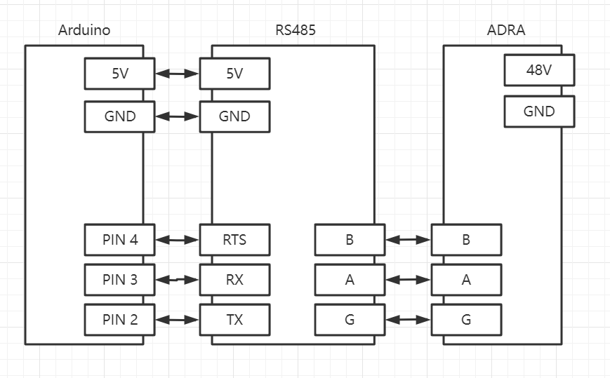

# Adra Arduino SDK

 >Sdk is use the SoftwareSerial for serial comminucate, you must config the correct **RxPin** ，**TxPin** and **RtsPin**. if the **RxPin** is pin 2, **TxPin** is pin 3, **rtsPin** is pin 4. you can init like this.

    #include <adra_api.h>
    AdraApi adraApi(2,3,4);

>AdraApi Constructor is 

    AdraApi(uint8_t rxPin, uint8_t txPin, uint8_t rts);

>After that, you need to set the baud for connect. for example, baud is 115200. (***pay attention, the [max baud rate](https://www.arduino.cc/en/Reference/SoftwareSerialBegin) of arduino is 115200, if the adra's baud more than it, you need [change the baud rate](./doc/change_id.md) with [Adra Assistant](https://www.umbratek.com/download-center).***)

    adraApi.connect(115200);

>Then, you can comminucate with adra. for example, get the adra's current position.

    float buf;
    int8_t ret = adraApi.get_pos_current(1,&buf); //1 is the id of adra
    Serial.println(ret);
    Serial.println(buf);

> All the api is in the [adra_api.h](./src/adra_api.h)

# Install SDK to Arduino

Download the SDK ,and unzip it to the libraries path of Arduino. Then restart Arduino IDE. Then you can see the sdk library in **Sketch->Include Library->ADRA_SDK_ARDUINO**

<!--  -->

# Reference example

You can reference example in the sdk. Find the exmaple in **File->Examples->ADRA_SDK_ARDUINO**

<!--  -->